International Cybersecurity and Digital Forensics Academy (ICDFA)

SBT-DF203: Basic Networking Skills for Digital Forensics

<table>
<tr>
<td>Course Code</td>
<td>SBT-DF203</td>
</tr>
<tr>
<td>Registration Number</td>
<td>FWSD2511424</td>
</tr>
<tr>
<td>Course Title</td>
<td>Basic Networking Skills for Digital Forensics</td>
</tr>
<tr>
<td>Lab Number</td>
<td>Lab 9</td>
</tr>
<tr>
<td>Lab Title</td>
<td>WEP40 Wireless Packet Decryption and Aircrack Forensics</td>
</tr>
<tr>
<td>Required Evidence</td>
<td>Historical CodeGate CTF file.xz/file capture supplied for offline analysis</td>
</tr>
</table>

Learning Outcomes

Identify management, control and data frames in an 802.11 capture.

Explain WEP40 structure, RC4 keystream use, IV reuse and integrity limitations.

Use Aircrack-ng on a supplied historical capture only.

Decrypt WEP traffic using airdecap-ng and verify output files.

Extract IP/MAC endpoints, protocols, images and HTML from decrypted traffic.

Distinguish a WEP key from a human passphrase and document optional CTF password analysis.

Recommend modern wireless security controls.

Executive Summary

This lab investigated a historical WEP40 wireless capture using Wireshark, TShark, Aircrack-ng and airdecap-ng. The supplied compressed evidence was preserved, hashed and decompressed before analysis. The capture was an IEEE 802.11 wireless LAN pcap containing 45,169 packets over approximately 272.97 seconds. The identified wireless network was the cgnetwork ESSID with BSSID 00:26:66:55:97:D6. Analysis identified 15,477 WEP data IVs, and the repeated IV summary showed several IV values occurring multiple times. Aircrack-ng successfully recovered the WEP40 key A4:3D:F6:F3:74 and reported the capture as correctly decrypted. airdecap-ng produced working/file_working-dec, after which higher-layer traffic could be examined. The decrypted traffic included IP, TCP, DNS, DHCP, ARP, IGMPv2, ICMPv6 and TLS-related traffic. Endpoint analysis identified 192.168.0.15 as the main host and 192.168.0.1 as the gateway/server-side endpoint, with their associated MAC addresses visible in the decrypted traffic. HTTP object export and foremost carving recovered images and HTML files. The evidence demonstrates the weaknesses of legacy WEP, particularly short IVs, IV reuse and weak protection against key recovery.

Lab Folder Structure and Evidence Preparation

Command used: mkdir -p ~/SBT-DF203-Lab9/{evidence,working,exported,reports,screenshots,scripts}

command used: cd ~/SBT-DF203-Lab9

command used: pwd

command used: find . -maxdepth 1 -type d -print

Create the folder structure before downloading or generating evidence. Store original captures under evidence and analysis copies under working.

sudo apt update
command used: sudo apt install -y aircrack-ng wireshark tshark foremost binwalk xz-utils

command used: wget -O evidence/file.xz \
  'https://raw.githubusercontent.com/ctfs/write-ups-2015/master/codegate-ctf-2015/programming/good-crypto/file.xz'

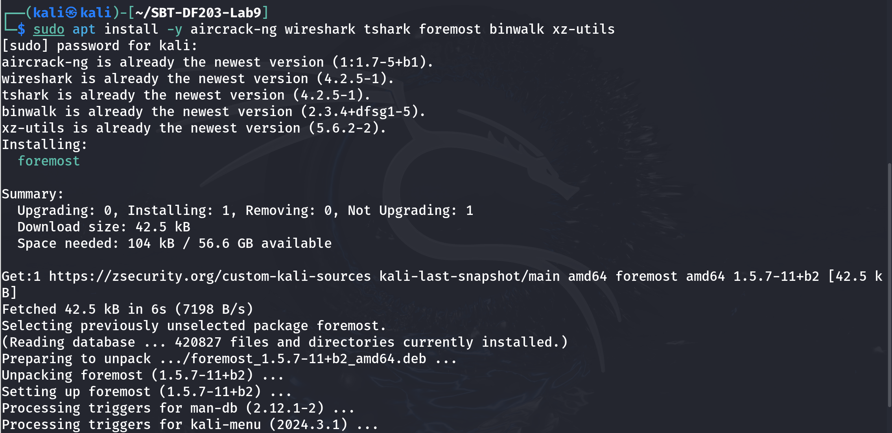

command used: sha256sum evidence/file.xz | tee reports/file_xz_sha256.txt

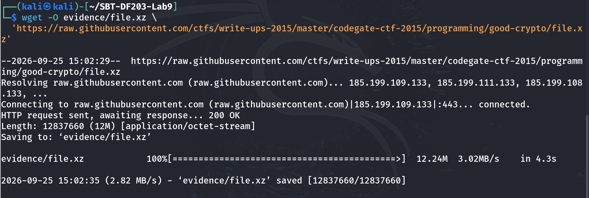

command used: cp --preserve=timestamps evidence/file.xz working/file_working.xz
unxz -k working/file_working.xz

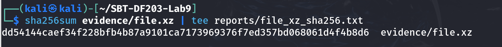

command used: file working/file_working

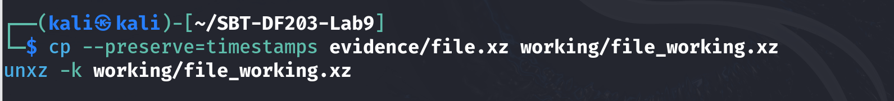

sha256sum working/file_working.xz working/file_working | tee reports/working_hashes.txt

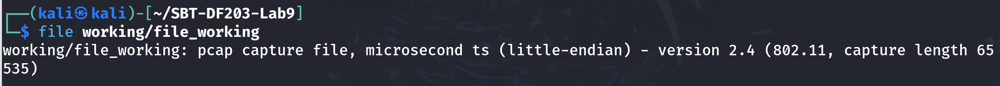

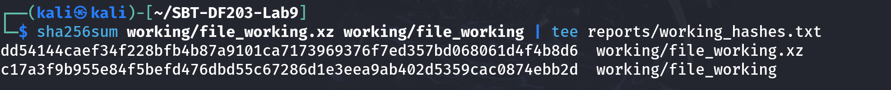

Screenshot required: Compressed evidence, decompressed capture type and SHA-256 hashes.

Mini Evidence and Chain-of-Custody Worksheet

<table>
<tr>
<td>Field</td>
<td>Student Entry</td>
</tr>
<tr>
<td>Case/lab identifier</td>
<td>SBT-DF203-Lab9-Basiru-Aliyu</td>
</tr>
<tr>
<td>Trainee name</td>
<td>Basiru Aliyu</td>
</tr>
<tr>
<td>Date and time started</td>
<td>25/09/2026 15:02</td>
</tr>
<tr>
<td>Evidence file name(s)</td>
<td>evidence/file.xz; working/file_working; working/file_working-dec</td>
</tr>
<tr>
<td>Source or generation method</td>
<td>Historical CodeGate CTF file.xz supplied for offline forensic analysis.</td>
</tr>
<tr>
<td>Original SHA-256</td>
<td>dd54144caef34f228bfb4b87a9101ca7173969376f7ed357bd068061d4f4b8d6</td>
</tr>
<tr>
<td>Working-copy SHA-256</td>
<td>dd54144caef34f228bfb4b87a9101ca7173969376f7ed357bd068061d4f4b8d6 (working/file_working.xz); c17a3f9b955e84f5befd476dbd55c67286d1e3eea9ab402d5359cac0874ebb2d (decompressed working/file_working)</td>
</tr>
<tr>
<td>Analysis workstation/VM</td>
<td>Kali Linux VM</td>
</tr>
</table>

Part A - Inventory the Wireless Capture

Command used: CAP=working/file_working

command used: capinfos "$CAP" | tee reports/capinfos.txt

command used: tshark -r "$CAP" -q -z io,phs | tee reports/protocol_hierarchy.txt

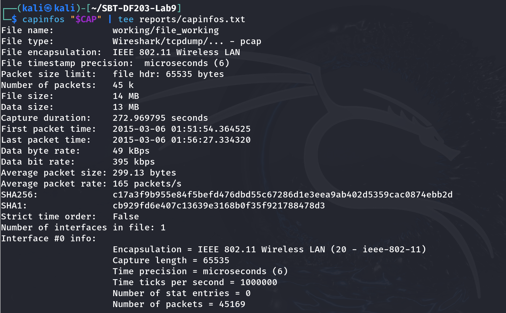

command used: tshark -r "$CAP" -Y 'wlan' -T fields \
  -e frame.number -e frame.time -e wlan.fc.type -e wlan.fc.subtype -e wlan.sa -e wlan.da -e wlan.bssid \
  | head -n 100 | tee reports/wlan_frame_sample.tsv

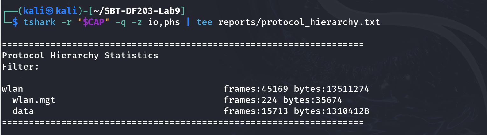

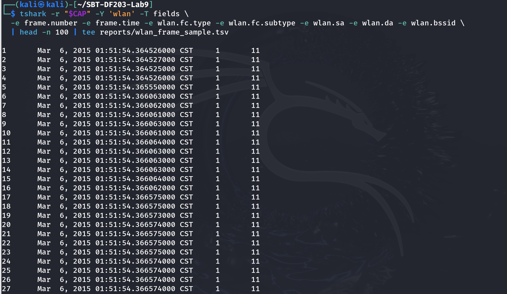

<table>
<tr>
<td>Frame Category</td>
<td>Type Value</td>
<td>Purpose</td>
<td>Example Evidence</td>
</tr>
<tr>
<td>Management</td>
<td>0</td>
<td>Association, authentication and beacon frames</td>
<td>Example evidence: early capture frames are management frames (subtype 11 shown in sample).</td>
</tr>
<tr>
<td>Control</td>
<td>1</td>
<td>Flow control and acknowledgements</td>
<td>Control frames are part of normal 802.11 communication.</td>
</tr>
<tr>
<td>Data</td>
<td>2</td>
<td>Carries network payload</td>
<td>Protected WEP data frames are present; 15,477 WEP data IVs were reported by Aircrack-ng.</td>
</tr>
</table>

Part B - Identify WEP Protection and Key Parameters

Confirm that protected data frames are present.

Record BSSID, source/destination MAC addresses and IV-related fields where dissected.

Explain that 64-bit WEP normally combines a 24-bit IV with a 40-bit secret key.

Explain why repeated IVs and RC4 weaknesses make WEP unsuitable.

Command used: tshark -r "$CAP" -Y 'wlan.fc.protected==1' -T fields \
  -e frame.number -e frame.time_epoch -e wlan.sa -e wlan.da -e wlan.bssid -e wlan.wep.iv -e wlan.wep.key \
  | head -n 200 | tee reports/wep_protected_frames.tsv

command used: tshark -r "$CAP" -Y 'wlan.fc.protected==1' -T fields -e wlan.wep.iv \
  | sort | uniq -c | sort -nr | head -n 30 | tee reports/repeated_iv_summary.txt

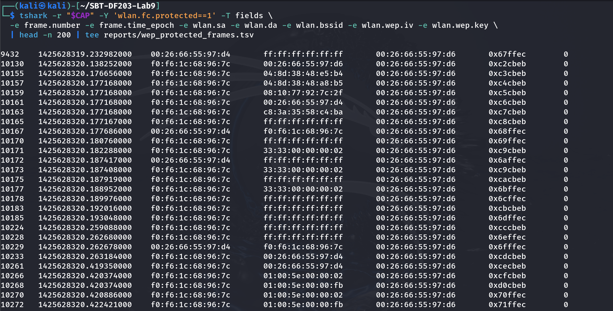

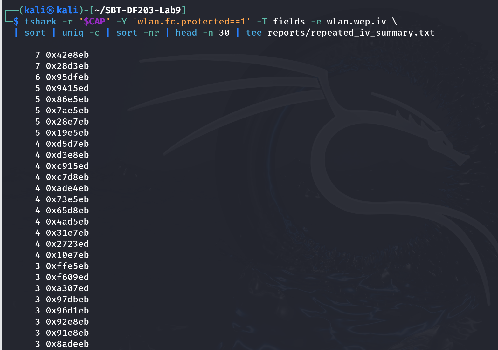

Part C - Recover or Validate the WEP40 Key

Run Aircrack-ng against the supplied capture. Record selected network/BSSID, number of IVs, key length and recovered key. The slide-provided key is A4:3D:F6:F3:74, entered without colons for airdecap-ng.

Command used: aircrack-ng "$CAP" | tee reports/aircrack_output.txt

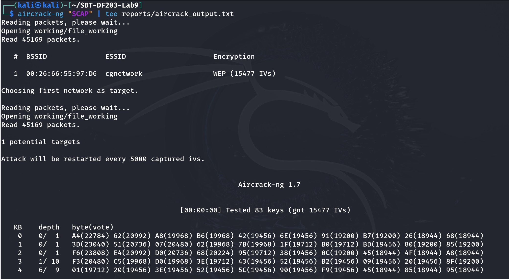

# Expected historical training key from the slide: A4:3D:F6:F3:74
command used: printf 'A4:3D:F6:F3:74\n' | tee reports/validated_wep40_key_masked.txt

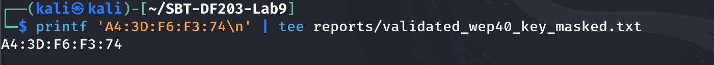

Part D - Decrypt the Capture Offline

Command used: cd working

command used: airdecap-ng -w A43DF6F374 file_working | tee ../reports/airdecap_output.txt

command used: cd ..

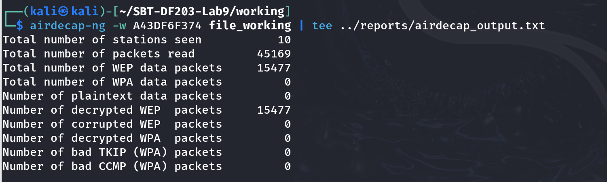

command used: find working -maxdepth 1 -type f -ls | tee reports/decrypted_files_inventory.txt

command used: sha256sum working/* | tee reports/all_working_file_hashes.txt

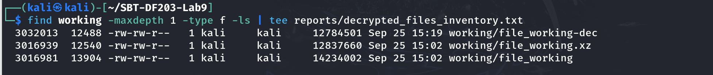

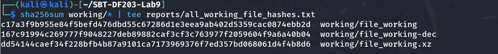

Identify the file created by airdecap-ng, usually with a -dec suffix. Open it in Wireshark and confirm that IP/TCP/HTTP or other higher-layer protocols are now visible.

Part E - Extract Endpoints and Conversations

Command used: DEC=$(find working -maxdepth 1 -type f -name '*-dec*' | head -n 1)

command used: echo "Decrypted capture: $DEC" | tee reports/decrypted_capture_path.txt

command used: tshark -r "$DEC" -q -z endpoints,eth | tee reports/ethernet_endpoints.txt

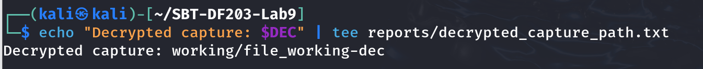

command used: tshark -r "$DEC" -q -z endpoints,ip | tee reports/ip_endpoints.txt

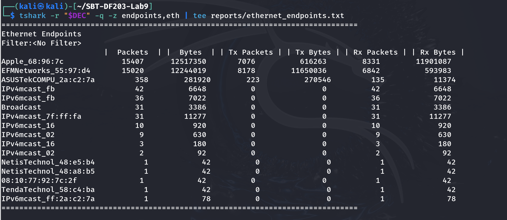

command used: tshark -r "$DEC" -q -z conv,tcp | tee reports/tcp_conversations.txt

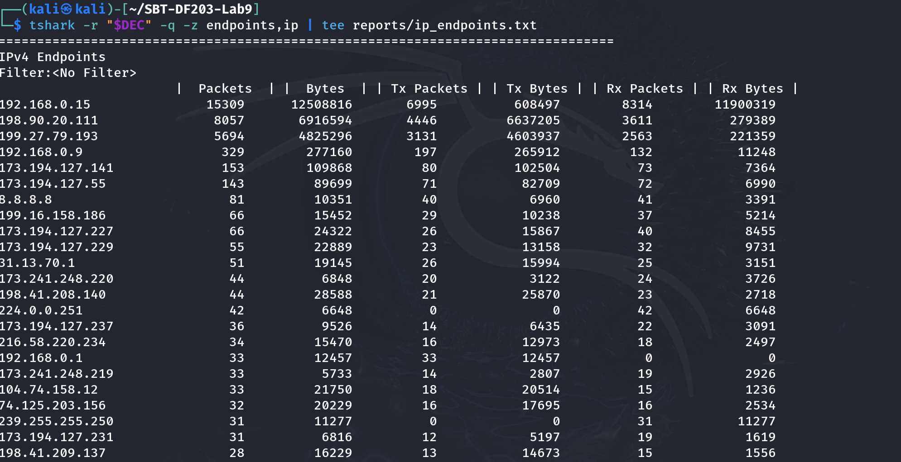

command used: tshark -r "$DEC" -Y 'ip' -T fields -e frame.number -e wlan.sa -e wlan.da -e ip.src -e ip.dst -e _ws.col.Protocol \
  | head -n 200 | tee reports/ip_mac_mapping_sample.tsv

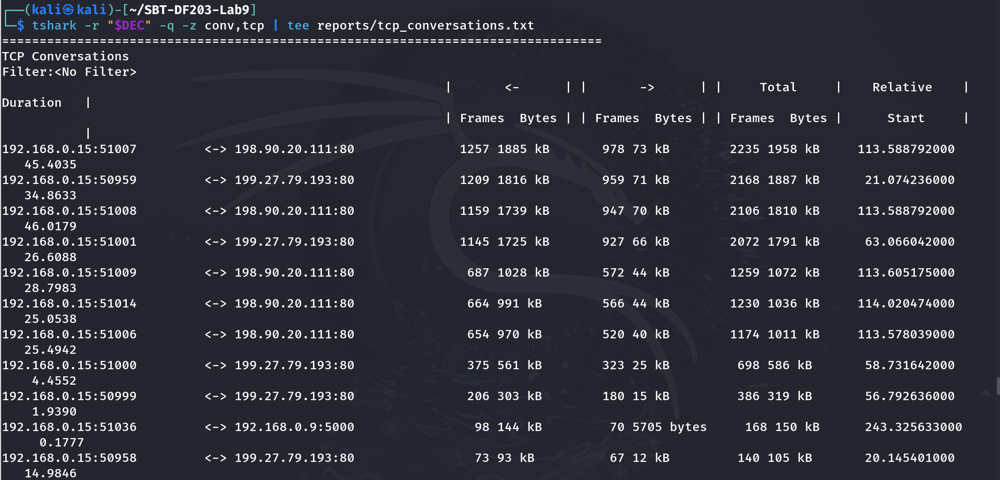

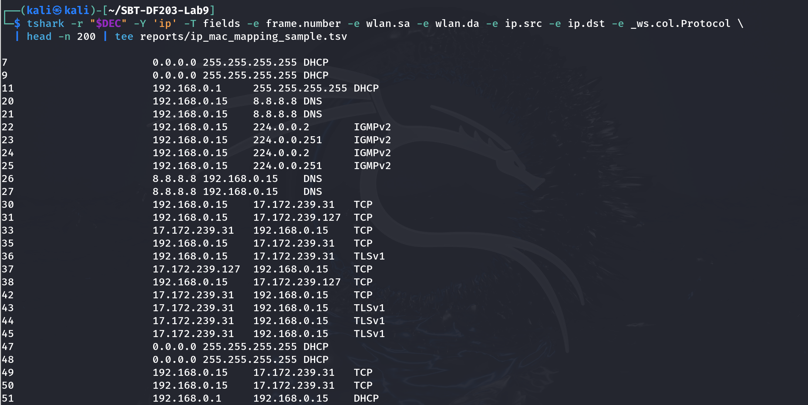

Part F - Extract Images, HTML and Other Objects

First try Wireshark File > Export Objects for HTTP or other recognized protocols.

Use tshark object export for HTTP where available.

Use foremost as a carving method and document that carved files may include false positives or lack original filenames.

Open recovered objects only inside the lab VM and hash them before viewing.

Command used: mkdir -p exported/http_objects exported/foremost

# HTTP object export if HTTP is present
command used: tshark -r "$DEC" --export-objects http,exported/http_objects 2>&1 | tee reports/http_export_log.txt

# Generic carving
command used: foremost -i "$DEC" -o exported/foremost | tee reports/foremost_log.txt

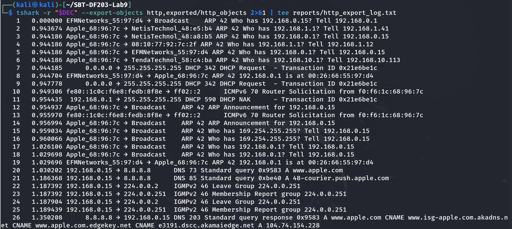

command used: find exported -type f -exec file {} \; | tee reports/exported_file_types.txt

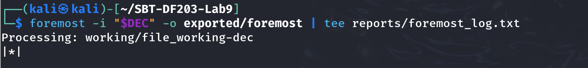

command used: find exported -type f -exec sha256sum {} \; | tee reports/exported_file_hashes.txt

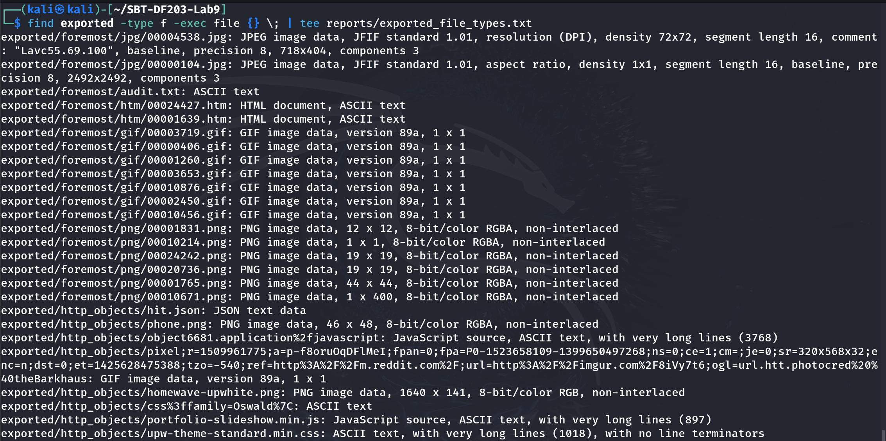

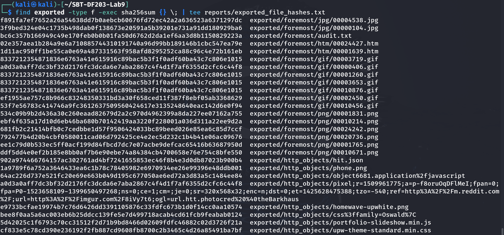

Required Findings Worksheet

<table>
<tr>
<td>Question</td>
<td>Finding</td>
</tr>
<tr>
<td>Capture format and duration</td>
<td>pcap / IEEE 802.11 Wireless LAN; 45,169 packets; 272.969795 seconds (01:51:54.364525 to 01:56:27.334320 on 06 Mar 2015).</td>
</tr>
<tr>
<td>BSSID</td>
<td>00:26:66:55:97:D6 (ESSID: cgnetwork).</td>
</tr>
<tr>
<td>Primary station MAC addresses</td>
<td>f0:f6:1c:68:96:7c (Apple station) and 00:26:66:55:97:D4 (EFMNetworks gateway-side MAC). Other stations are also present.</td>
</tr>
<tr>
<td>Protected frame count</td>
<td>15,477 WEP data/IVs reported by Aircrack-ng.</td>
</tr>
<tr>
<td>Repeated IV evidence</td>
<td>Yes. The repeated-IV summary shows reuse; examples include 0x42e8eb and 0x28d3eb occurring 7 times each, 0x95dfeb 6 times, and several others 3–5 times.</td>
</tr>
<tr>
<td>Recovered/validated WEP40 key</td>
<td>A4:3D:F6:F3:74 (entered to airdecap-ng as A43DF6F374).</td>
</tr>
<tr>
<td>Decrypted capture filename/hash</td>
<td>working/file_working-dec | SHA-256: 167cc91994c269777f9048227deb89882caf3cf3c763977f2059604f9a6a40b04</td>
</tr>
<tr>
<td>Host IP and MAC</td>
<td>192.168.0.15 | f0:f6:1c:68:96:7c</td>
</tr>
<tr>
<td>Server IP and MAC</td>
<td>192.168.0.1 | 00:26:66:55:97:D4</td>
</tr>
<tr>
<td>Key protocols observed</td>
<td>ARP, DHCP, DNS, IGMPv2, ICMPv6, TCP and TLSv1; HTTP objects were also exported from the decrypted capture.</td>
</tr>
<tr>
<td>Recovered images/HTML</td>
<td>Yes. Foremost recovered JPEG and HTML files; HTTP export also recovered phone.png, homewave-upwhite.png and other web objects.</td>
</tr>
<tr>
<td>Optional router passphrase</td>
<td>Protected appendix only</td>
</tr>
<tr>
<td>Security conclusion</td>
<td></td>
</tr>
</table>

Conclusion

The WEP40 wireless forensics lab successfully demonstrated the process of preserving, identifying, analyzing and decrypting a historical 802.11 capture. The capture contained 45,169 packets over approximately 273 seconds and was associated with the cgnetwork BSSID 00:26:66:55:97:D6. Analysis identified 15,477 WEP IVs and clear evidence of IV reuse. Aircrack-ng recovered the WEP40 key A4:3D:F6:F3:74, and airdecap-ng produced the decrypted capture working/file_working-dec. Endpoint and conversation analysis then exposed higher-layer network activity, including ARP, DHCP, DNS, TCP and TLS-related traffic. HTTP export and file carving recovered images and HTML objects. The results show why WEP40 is unsuitable for modern wireless security and support replacing legacy WEP with WPA2-AES/CCMP or WPA3.
